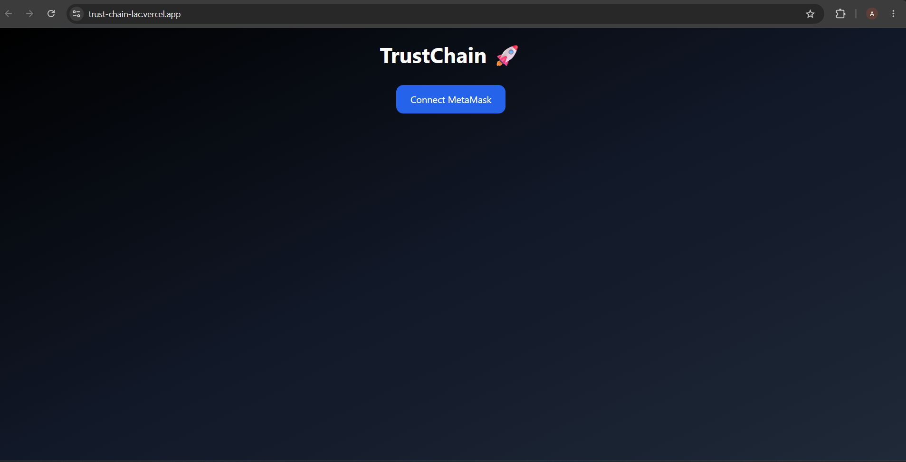
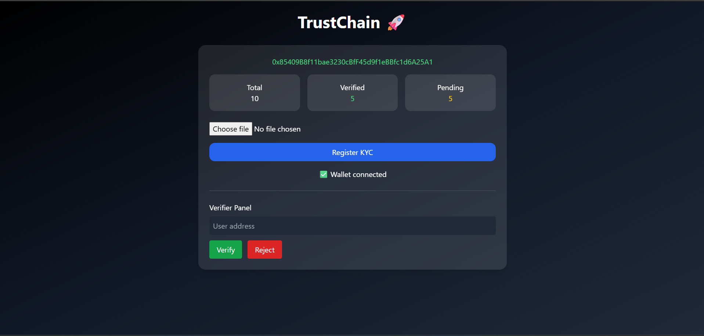
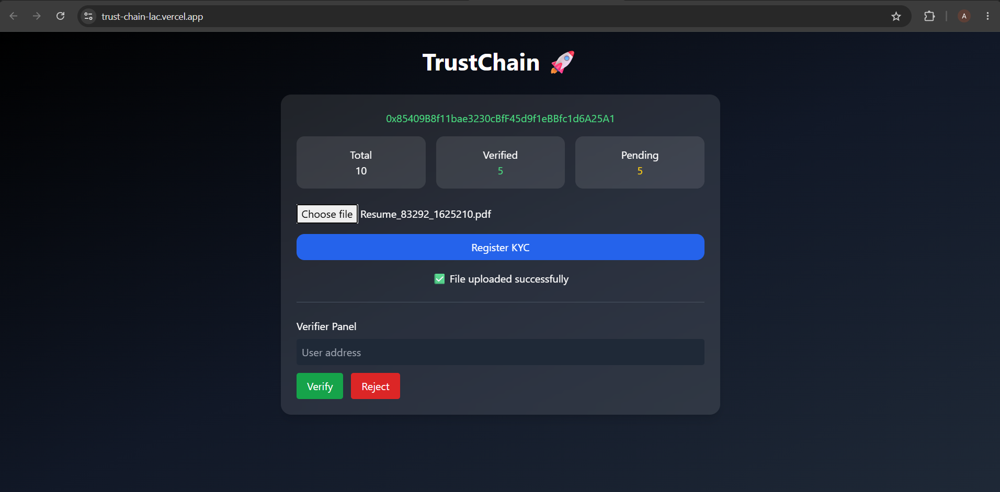
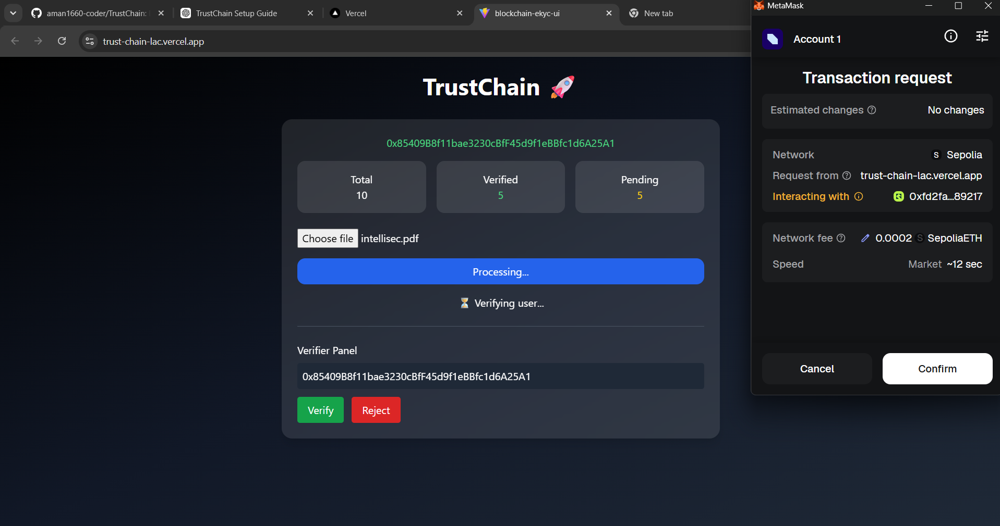

# 🚀 TrustChain — Blockchain-Based eKYC Verification System

<div align="center">

### Secure • Decentralized • Transparent • Tamper-Resistant

**A decentralized eKYC platform powered by Ethereum, Solidity, IPFS, Pinata, React, and MetaMask.**

<br>

[](https://trust-chain-lac.vercel.app/)

[](https://ethereum.org/)
[](https://soliditylang.org/)
[](https://react.dev/)
[](https://vite.dev/)
[](https://ipfs.tech/)
[](https://metamask.io/)

</div>

---

## 🌐 Live Application

TrustChain is successfully deployed and accessible online.

### 👉 [Launch TrustChain Live Application](https://trust-chain-lac.vercel.app/)

> **Note:** MetaMask and the Ethereum Sepolia Testnet are required to perform blockchain transactions.

---

## 📌 About The Project

**TrustChain** is a blockchain-based Electronic Know Your Customer (**eKYC**) decentralized application designed to demonstrate a secure, transparent, and tamper-resistant approach to digital identity verification.

Traditional KYC systems generally depend on centralized databases for storing and managing identity records. Such systems may introduce challenges related to data integrity, transparency, unauthorized modification, and single points of failure.

TrustChain explores a decentralized approach by combining **Ethereum smart contracts** with **IPFS-based document storage**.

The platform allows users to connect their MetaMask wallet, upload KYC documents to IPFS, register their KYC information through an Ethereum smart contract, and submit their identity for verification.

Authorized verifiers can approve or reject registered users, while blockchain technology provides transparent and immutable transaction records.

---

# 📸 Application Preview

## 🔗 1. Connect MetaMask Wallet

Users begin by connecting their MetaMask wallet to the TrustChain decentralized application.



---

## 📊 2. TrustChain Dashboard

After successfully connecting the wallet, users can access the main TrustChain dashboard.

The dashboard displays:

- Connected Ethereum wallet address
- Total registered users
- Number of verified users
- Number of pending users
- KYC document upload functionality
- Verifier Panel



---

## 📂 3. Upload KYC Document

Users can select their KYC document and upload it through the TrustChain interface.

The document is uploaded to decentralized IPFS storage using Pinata.




---

## ✅ 4. User Verification

Authorized verifiers can enter the Ethereum wallet address of a registered user and approve or reject the KYC request.

The verification operation is executed through the deployed Ethereum smart contract.



---

# ✨ Key Features

- 🔐 Blockchain-based eKYC verification
- ⛓️ Ethereum smart contract integration
- 🌐 Deployed on the Ethereum Sepolia Testnet
- 📂 Decentralized document storage using IPFS
- 📌 Pinata integration for IPFS file management
- 🦊 MetaMask wallet authentication
- 👤 Wallet-based KYC registration
- ✅ Authorized user verification
- ❌ KYC rejection functionality
- 📊 Real-time KYC statistics dashboard
- 🔍 Transparent blockchain transactions
- 🛡️ Tamper-resistant verification records
- 🚀 Live deployment using Vercel
- 💻 Responsive React-based user interface

---

# 🛠️ Technology Stack

| Category | Technology |
|---|---|
| Frontend | React.js |
| Build Tool | Vite |
| Programming Language | JavaScript |
| Blockchain | Ethereum |
| Test Network | Sepolia Testnet |
| Smart Contracts | Solidity |
| Development Environment | Hardhat |
| Blockchain Library | Ethers.js |
| Crypto Wallet | MetaMask |
| Decentralized Storage | IPFS |
| IPFS Service | Pinata |
| Frontend Deployment | Vercel |
| Version Control | Git |
| Repository Hosting | GitHub |

---

# 🏗️ System Architecture

```text
                         ┌─────────────────────┐
                         │        USER         │
                         └──────────┬──────────┘
                                    │
                                    ▼
                         ┌─────────────────────┐
                         │   React + Vite UI   │
                         └──────────┬──────────┘
                                    │
                   ┌────────────────┴────────────────┐
                   │                                 │
                   ▼                                 ▼
        ┌─────────────────────┐           ┌─────────────────────┐
        │   MetaMask Wallet   │           │    KYC Document     │
        └──────────┬──────────┘           └──────────┬──────────┘
                   │                                 │
                   ▼                                 ▼
        ┌─────────────────────┐           ┌─────────────────────┐
        │   Ethers.js Layer   │           │       Pinata        │
        └──────────┬──────────┘           └──────────┬──────────┘
                   │                                 │
                   ▼                                 ▼
        ┌─────────────────────┐           ┌─────────────────────┐
        │ Solidity Smart      │           │        IPFS         │
        │ Contract            │           │ Decentralized Store │
        └──────────┬──────────┘           └─────────────────────┘
                   │
                   ▼
        ┌─────────────────────┐
        │ Ethereum Sepolia    │
        │ Testnet             │
        └─────────────────────┘
```

---

# ⚙️ How TrustChain Works

```text
Connect MetaMask
        ↓
Select KYC Document
        ↓
Upload Document to IPFS
        ↓
Generate IPFS CID
        ↓
Process KYC Information
        ↓
Interact with Solidity Smart Contract
        ↓
Confirm Transaction through MetaMask
        ↓
Store KYC Registration on Ethereum
        ↓
Verifier Enters User Wallet Address
        ↓
Approve or Reject KYC
        ↓
Record Verification Result on Blockchain
```

### Detailed Workflow

1. The user opens the TrustChain web application.

2. The user connects their MetaMask wallet.

3. TrustChain communicates with the Ethereum Sepolia Testnet.

4. The user selects a KYC document.

5. The document is uploaded to IPFS using Pinata.

6. IPFS generates a unique Content Identifier (**CID**) for the uploaded document.

7. The frontend interacts with the deployed Solidity smart contract using Ethers.js.

8. MetaMask requests confirmation for the blockchain transaction.

9. After transaction confirmation, the user's KYC registration is processed by the smart contract.

10. An authorized verifier enters the wallet address of a registered user.

11. The verifier can approve or reject the user's KYC request.

12. The verification result is processed through the Ethereum smart contract.

---

# 🔐 Security & Decentralization

TrustChain demonstrates several important blockchain and Web3 security concepts:

### ⛓️ Blockchain Immutability

Blockchain transactions provide a transparent and tamper-resistant record of KYC operations.

### 📂 Decentralized File Storage

Documents are uploaded using IPFS instead of relying entirely on traditional centralized file storage.

### 🦊 Wallet-Based Authentication

Users interact with the decentralized application through their Ethereum wallet.

### 📝 Smart Contract Verification

KYC registration and verification logic is managed through a Solidity smart contract.

### 👨‍⚖️ Authorized Verifier System

Verification functionality is restricted according to the authorization logic implemented in the smart contract.

---

# 📜 Smart Contract Information

The TrustChain smart contract is deployed on the **Ethereum Sepolia Testnet**.

### Contract Address

```text
0xfd2faDb2B1B4Ce8d3F9a6B937B2E1fE418589217
```

### Smart Contract Responsibilities

The smart contract handles:

- User KYC registration
- KYC information management
- Verifier authorization
- User verification
- User rejection
- KYC status management
- Blockchain transaction processing

---

# 📁 Project Structure

```text
TrustChain/
│
├── BlockchainEKYC/
│   │
│   ├── contracts/
│   │   └── EKYC.sol
│   │
│   ├── scripts/
│   ├── artifacts/
│   ├── ignition/
│   ├── test/
│   └── hardhat.config.js
│
├── BlockchainEKYC-UI/
│   │
│   ├── src/
│   │   ├── App.jsx
│   │   ├── App.css
│   │   └── main.jsx
│   │
│   ├── public/
│   ├── package.json
│   └── vite.config.js
│
├── screenshots/
│   ├── connect-wallet.png
│   ├── dashboard.png
│   ├── upload-kyc.png
│   ├── blockchain-transaction.png
│   └── user-verification.png
│
├── .gitignore
└── README.md
```

---

# 🚀 Getting Started

## Prerequisites

Before running TrustChain locally, make sure you have:

- Node.js
- npm
- Git
- MetaMask browser extension
- SepoliaETH for test transactions

---

## 1️⃣ Clone the Repository

```bash
git clone https://github.com/aman1660-coder/TrustChain.git
```

---

## 2️⃣ Navigate to the Project

```bash
cd TrustChain
```

---

## 3️⃣ Install Frontend Dependencies

```bash
cd BlockchainEKYC-UI
npm install
```

---

## 4️⃣ Start the Development Server

```bash
npm run dev
```

The application will start using the Vite development server.

Open the localhost address displayed in your terminal.

---

# 🦊 MetaMask Setup

To interact with TrustChain:

1. Install the MetaMask browser extension.

2. Create or import an Ethereum wallet.

3. Enable the Sepolia Test Network.

4. Obtain SepoliaETH for testing purposes.

5. Open the TrustChain application.

6. Click **Connect MetaMask**.

7. Approve the connection request.

8. Confirm blockchain transactions when required.

---

# 💡 Technical Concepts Demonstrated

This project demonstrates practical implementation of:

- Web3 application development
- Decentralized applications (DApps)
- Ethereum blockchain interaction
- Solidity smart contract development
- Smart contract deployment
- MetaMask wallet integration
- Ethers.js contract interaction
- IPFS decentralized storage
- Pinata IPFS integration
- Blockchain transaction signing
- Ethereum testnet deployment
- React frontend development
- Vite application deployment
- Git and GitHub version control
- Vercel cloud deployment

---

# 🎯 Project Objective

The primary objective of TrustChain is to explore how blockchain and decentralized storage technologies can be integrated to develop a transparent and tamper-resistant electronic KYC verification system.

The project demonstrates the complete development lifecycle of a decentralized application — from Solidity smart contract development and Ethereum deployment to IPFS integration, MetaMask interaction, React frontend development, GitHub version control, and live cloud deployment.

---

# 🚧 Challenges Solved During Development

During the development of TrustChain, several real-world Web3 development challenges were addressed:

- Smart contract deployment on Ethereum Sepolia
- MetaMask wallet integration
- Contract ABI integration with the React frontend
- Ethereum transaction handling
- IPFS API integration
- Migration from incompatible IPFS services
- Pinata decentralized storage integration
- Smart contract function and ABI synchronization
- Verifier authorization management
- Blockchain transaction debugging
- React and Ethers.js integration
- Git and GitHub repository management
- Production deployment using Vercel

---

# 🔮 Future Enhancements

Future development of TrustChain could include:

- 🤖 AI-based KYC document verification
- 🔎 OCR-based document information extraction
- 🧠 AI-powered fraud detection
- 🔐 Zero-Knowledge Proof identity verification
- 🪪 Decentralized Identity (DID) integration
- 👨‍💼 Dedicated administrator dashboard
- 👥 Multi-verifier consensus mechanism
- 📱 Mobile application support
- 📷 QR code-based identity verification
- 🔔 Real-time verification notifications
- 🌍 Multi-chain blockchain support
- 📊 Advanced KYC analytics dashboard

---

# 🌐 Deployment

The TrustChain frontend is deployed using Vercel.

### 🚀 Live Application

**https://trust-chain-lac.vercel.app/**

The smart contract operates on the Ethereum Sepolia Testnet, while KYC documents are handled using IPFS and Pinata.

---

# 👨‍💻 Developer

## Aman Kumar Singh

**Computer Science and Engineering**

Specialization in **IoT, Cyber Security and Blockchain Technology**

Interested in:

- Blockchain Development
- Web Development
- Cyber Security
- Internet of Things
- Artificial Intelligence

---

<div align="center">

## ⭐ Support The Project

If you found TrustChain interesting, consider giving the repository a ⭐.

### [🚀 View Live Application](https://trust-chain-lac.vercel.app/)

### Built with React, Solidity, Ethereum, IPFS & Web3

</div>